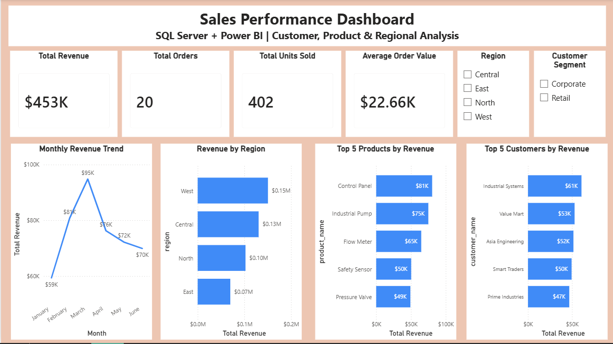

# 📊 Sales Performance Dashboard using Power BI

## 📌 Project Overview

This project demonstrates the development of an interactive Power BI dashboard for analyzing sales performance and generating business insights.

The dashboard connects sales data with Power BI to monitor key performance indicators (KPIs), identify trends, and analyze customer, product, and regional performance.

---

## 🎯 Business Objectives

The dashboard was developed to help answer key business questions:

- What is the overall sales revenue?
- How many orders were placed?
- How many units were sold?
- What is the average order value?
- Which regions generate the highest revenue?
- Which products generate the highest revenue?
- Which customers contribute the most revenue?
- How does revenue change over time?
- How do different customer segments perform?

---

## 🛠️ Tools & Technologies

- Power BI Desktop
- SQL Server
- SQL Server Management Studio (SSMS)
- DAX
- Data Visualization
- Data Analysis

---

## 📈 Dashboard Features

### KPI Cards

- Total Revenue
- Total Orders
- Total Units Sold
- Average Order Value

### Interactive Filters

- Region
- Customer Segment

### Visual Analysis

- Monthly Revenue Trend
- Revenue by Region
- Top 5 Products by Revenue
- Top 5 Customers by Revenue

---

## 🔍 Key Analysis

The dashboard provides insights into:

- Monthly sales performance
- Regional revenue contribution
- Top-performing products
- Top-performing customers
- Customer segment performance
- Overall sales KPIs

---

## 📊 Dashboard Preview



---

## 📁 Repository Structure

```text
Sales-Performance-Dashboard/
│
├── screenshots/
│   └── Sales_Performance_Dashboard.png
│
├── Sales_Performance_Dashboard.pbix
│
└── README.md
